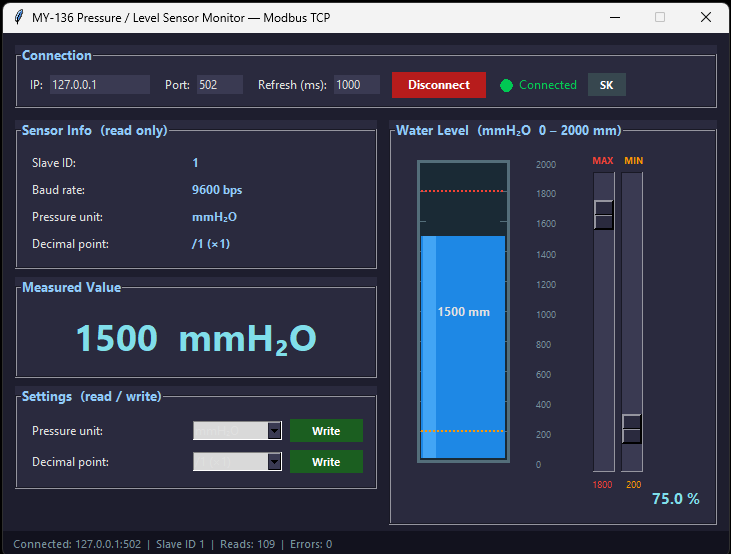
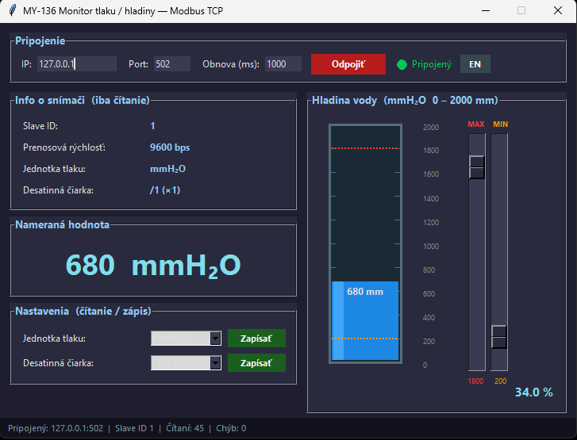

# MY-136 Pressure / Level Sensor Monitor

---

## EN — English

Desktop application for monitoring the **MY-136 pressure / level sensor** via Modbus TCP/IP
(RS485 sensor connected through a USR-DR134 RS485-to-Ethernet converter).



### Hardware

| Component | Details |
|-----------|---------|
| Sensor | MY-136 Pressure / Level Transmitter |
| Converter | USR-DR134 (RS485 → Ethernet) |
| Protocol | Modbus RTU → Modbus TCP |
| Default IP | `192.168.1.1` |
| Default Port | `502` |
| Default Slave ID | `1` |

### Download

Pre-built binaries are available on the [Releases](https://github.com/Orimslav/level_sensor/releases/latest) page:

| Platform | File |
|----------|------|
| Windows | `LevelSensorMonitor.exe` |
| Linux x86-64 | `LevelSensorMonitor-linux-x64` |
| Linux ARM64 (Raspberry Pi 4/5) | `LevelSensorMonitor-linux-arm64` |
| macOS Apple Silicon (M1/M2/M3/M4) | `LevelSensorMonitor-mac-arm64` |

> **macOS Intel:** GitHub Actions no longer provides Intel Mac runners. Intel Mac users can run the app from source (see below).

> **macOS — first launch:** The binary is not signed with an Apple certificate.
> Remove the quarantine flag before running:
> ```bash
> xattr -d com.apple.quarantine LevelSensorMonitor-mac-arm64
> chmod +x LevelSensorMonitor-mac-arm64
> ./LevelSensorMonitor-mac-arm64
> ```

> **Raspberry Pi:** Requires a 64-bit OS (Raspberry Pi OS 64-bit). For 32-bit OS run from source (see below).

### Requirements (run from source)

- Python 3.8+
- pymodbus >= 3.6.0
- tkinter (included in standard Python on Windows/macOS; on Linux: `sudo apt install python3-tk`)

### Installation (run from source)

```bash
git clone https://github.com/Orimslav/level_sensor.git
cd level_sensor

python -m venv venv
source venv/bin/activate        # Linux / macOS
venv\Scripts\activate           # Windows

pip install -r requirements.txt
```

### Usage

```bash
# Run the application
python level_sensor_monitor.py

# Run the simulator (no physical sensor required)
python simulator.py --port 502         # standard Modbus port
python simulator.py --mode sine        # smooth sine wave
python simulator.py --speed 2.0        # faster animation
```

When using the simulator, set IP to `127.0.0.1` and Port to `502` in the application.

### Modbus Protocol

| Address | Description | Access |
|---------|-------------|--------|
| 0 | Slave ID | read only |
| 1 | Baud rate code (3 = 9600 bps) | read only |
| 2 | Pressure unit — 0=MPa 1=kPa 2=Pa 3=Bar 4=mBar 5=kg/cm² 6=psi 7=mH₂O 8=mmH₂O | read/write |
| 3 | Decimal point — 0=/1 · 1=/10 · 2=/100 · 3=/1000 | read/write |
| 4 | Measured value (raw) — divide by decimal divisor | read only |
| 5 | Zero offset | read/write |

Function codes: **FC03** read holding registers · **FC06** write single register

### UI Overview

- **Connection bar** — IP, Port, refresh interval + Connect/Disconnect + status indicator + SK/EN toggle
- **Sensor info panel** — Slave ID, baud rate, pressure unit, decimal point (read only)
- **Measured value display** — large formatted readout; turns red on alarm
- **Settings panel** — pressure unit and decimal point dropdowns with Write buttons
- **Tank visualizer** — vertical tank (0–2000 mm), water turns red on alarm, dashed limit lines
- **MAX / MIN sliders** — alarm thresholds (default MAX=1800 mm, MIN=200 mm)
- **Status bar** — IP:port · Slave ID · read count · error count

### Hardware reference

[MY-136 Modbus Communication Protocol (PDF)](modbus_komunika__n___protokol_sn__ma__e_tlaku_my-136.pdf)

---

## SK — Slovensky

Desktopová aplikácia na monitorovanie **snímača tlaku / hladiny MY-136** cez Modbus TCP/IP
(RS485 snímač pripojený cez prevodník USR-DR134 RS485 → Ethernet).



### Hardware

| Komponent | Detail |
|-----------|--------|
| Snímač | MY-136 Tlakový / hladinový snímač |
| Prevodník | USR-DR134 (RS485 → Ethernet) |
| Protokol | Modbus RTU → Modbus TCP |
| Predvolená IP | `192.168.1.1` |
| Predvolený port | `502` |
| Predvolené Slave ID | `1` |

### Stiahnutie

Pripravené binárky sú dostupné na stránke [Releases](https://github.com/Orimslav/level_sensor/releases/latest):

| Platforma | Súbor |
|-----------|-------|
| Windows | `LevelSensorMonitor.exe` |
| Linux x86-64 | `LevelSensorMonitor-linux-x64` |
| Linux ARM64 (Raspberry Pi 4/5) | `LevelSensorMonitor-linux-arm64` |
| macOS Apple Silicon (M1/M2/M3/M4) | `LevelSensorMonitor-mac-arm64` |

> **macOS Intel:** GitHub Actions už neposkytuje Intel Mac runnery. Používatelia Intel Macu môžu spustiť aplikáciu zo zdrojového kódu (viď nižšie).

> **macOS — prvé spustenie:** Binárka nie je podpísaná Apple certifikátom.
> Pred spustením odstrániť karanténu:
> ```bash
> xattr -d com.apple.quarantine LevelSensorMonitor-mac-arm64
> chmod +x LevelSensorMonitor-mac-arm64
> ./LevelSensorMonitor-mac-arm64
> ```

> **Raspberry Pi:** Vyžaduje 64-bitový OS (Raspberry Pi OS 64-bit). Pre 32-bitový OS spustiť zo zdrojového kódu (viď nižšie).

### Požiadavky (spustenie zo zdrojového kódu)

- Python 3.8+
- pymodbus >= 3.6.0
- tkinter (súčasť štandardného Pythonu na Windows/macOS; na Linuxe: `sudo apt install python3-tk`)

### Inštalácia (spustenie zo zdrojového kódu)

```bash
git clone https://github.com/Orimslav/level_sensor.git
cd level_sensor

python -m venv venv
source venv/bin/activate        # Linux / macOS
venv\Scripts\activate           # Windows

pip install -r requirements.txt
```

### Spustenie

```bash
# Spustenie aplikácie
python level_sensor_monitor.py

# Spustenie simulátora (nevyžaduje fyzický snímač)
python simulator.py --port 502         # štandardný Modbus port
python simulator.py --mode sine        # plynulá sínus vlna
python simulator.py --speed 2.0        # rýchlejšia animácia
```

Pri použití simulátora nastaviť v aplikácii IP: `127.0.0.1`, Port: `502`.

### Modbus protokol

| Adresa | Popis | Prístup |
|--------|-------|---------|
| 0 | Slave ID | iba čítanie |
| 1 | Baud rate kód (3 = 9600 bps) | iba čítanie |
| 2 | Jednotka tlaku — 0=MPa 1=kPa 2=Pa 3=Bar 4=mBar 5=kg/cm² 6=psi 7=mH₂O 8=mmH₂O | čítanie/zápis |
| 3 | Desatinné miesto — 0=/1 · 1=/10 · 2=/100 · 3=/1000 | čítanie/zápis |
| 4 | Nameraná hodnota (raw) — vydeliť deliteľom desatinného miesta | iba čítanie |
| 5 | Nulový posun (zero offset) | čítanie/zápis |

Funkčné kódy: **FC03** čítanie holding registrov · **FC06** zápis jedného registra

### Rozhranie

- **Lišta pripojenia** — IP, Port, interval obnovy + Pripojiť/Odpojiť + indikátor + prepínač SK/EN
- **Panel info o snímači** — Slave ID, prenosová rýchlosť, jednotka tlaku, desatinné miesto (iba čítanie)
- **Displej nameranej hodnoty** — veľký formátovaný údaj; pri alarme sa sfarbí červeno
- **Panel nastavení** — dropdown jednotka tlaku a desatinné miesto s tlačidlami Zapísať
- **Vizualizácia nádrže** — vertikálna nádrž (0–2000 mm), voda červená pri alarme, prerušované čiary limitov
- **Posuvníky MAX / MIN** — prahové hodnoty alarmu (predvolené MAX=1800 mm, MIN=200 mm)
- **Stavový riadok** — IP:port · Slave ID · počet čítaní · počet chýb

### Dokumentácia hardvéru

[Modbus komunikačný protokol MY-136 (PDF)](modbus_komunika__n___protokol_sn__ma__e_tlaku_my-136.pdf)
